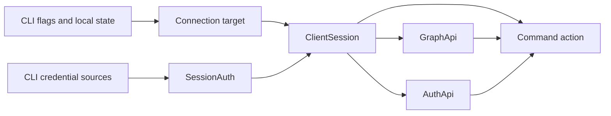

# CLI connection architecture

The private `connection` module owns one scoped bridge from existing CLI flags and local identity
state to the public Kernel Client. It selects the exact source Kernel URL and issuer, either omits
credentials for an explicit anonymous selection or resolves fresh source-Kernel authority for each
Call, binds Graph and Auth helpers, and closes every owned Client resource when the command action
terminates.

When a target also names an exact Domain issuer, the connection owner performs the client-mediated
`whoami -> delegate(attenuation) -> issuer exchange` journey. The resulting Domain token crosses
into ClientSession as an opaque credential; connection does not authorize Domain operations.

ClientSession owns source admission, Publication discovery, redirect witnessing, route caching, transport
selection, and the single safe stale-route recovery. The CLI does not reproduce those rules or
discover destination identity. `SessionAuth.resolve(call, signal)` returns source-Kernel authority and
ClientSession supplies an audience-free Delegate with omitted attenuation, preserving the exact
current Grant for routing. Connection itself persists no credential or route; the separate state
owner persists only exchanged source credentials.

`--anonymous` deliberately suppresses ambient and bookmark-default identities by omitting the
`SessionAuth` capability. It cannot be combined with `--as` or `--creds`; contradictory selections fail
before local identity state or a connection is opened. Public and optional callables can then
observe a genuinely anonymous caller, while required callables reject the request at the Kernel.

The target, timeout, and optional CA file are resolved before constructing the session. The CA file
customizes only the Fetch capability passed to Client. `withClientSession` and
`withAdminClientSession` are terminal lifecycle boundaries: success, failure, and cancellation all
close both the Client Session and its direct source-Auth client.

The command boundary projects typed Client failure identity, transport context, phase, and
invocation-only delivery evidence without inspecting a private cause message. Unknown native
failures become one honest unexpected diagnostic; their bounded cause graph is visible only under
explicit debug output. Every admitted Kernel reason remains available in machine output, while
human repair details require a bounded public Function issue or exact Query reason variant.
