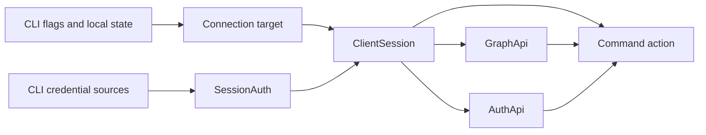

# CLI connection architecture

The private `connection` module owns one scoped bridge from existing CLI flags and local identity
state to the public Kernel Client. It selects the exact source Kernel URL and issuer, either omits
credentials for an explicit anonymous selection or resolves fresh source-Kernel authority for each
Call, binds Graph and Auth helpers, and closes every owned Client resource when the command action
terminates.

When a target also names an exact Domain issuer, or the origin of an installed Domain, the connection
owner obtains a Domain token through the Kernel Client's `session.exchange(issuer)`, which runs the
`whoami -> delegate(attenuation) -> issuer exchange` journey and admits the Domain response. The
connection owner keeps only what outlives one Client call: the persisted cache, the command-timeout
lifetime rules, retry of a delegation whose outcome is unknown, and the mapping of each Client
`ExchangeError` failure reason to a stable CLI error code. The resulting Domain token crosses into
ClientSession as an opaque credential; connection does not authorize Domain operations. Its carried
Grant must be exactly the caller proof. Fresh or cached credentials that add Domain self or any
other authority are rejected rather than forwarded to the Kernel.

```mermaid
flowchart LR
  F[CLI flags and local state] --> T[Connection target]
  T --> H[ClientSession]
  C[CLI credential sources] --> R[SessionAuth]
  R --> H
  H --> G[GraphApi]
  H --> A[AuthApi]
  H --> X[Command action]
  G --> X
  A --> X
```

ClientSession owns source admission, Publication discovery, redirect witnessing, route caching, transport
selection, and the single safe stale-route recovery. The CLI does not reproduce those rules or
discover destination identity. `SessionAuth.resolve(call, signal)` returns source-Kernel authority and
ClientSession supplies an audience-free Delegate with omitted attenuation, preserving the exact
current Grant for routing. Connection itself persists no credential or route; the separate state
owner persists exchanged source credentials and the separate Kernel Client route artifact. Stable
issuer and subject metadata from the selected persisted IdP identity may select only an exact,
cryptographically admitted exchange entry before source-token refresh. Missing, unreadable, or
mismatched metadata falls through to ordinary source resolution. Cache misses alone resolve the
registered Kernel User and perform delegation plus Domain exchange.
An Astrale-managed Instance exchanges its users through its installed Shell, named by origin
(`shell.astrale.ai`) and never by an issuer derived from the route: the Shell's issuer is whatever
the source Kernel's pin names, and a reinstall from an immutable deployment changes it. A bookmark
that names an explicit exact Domain issuer is exchanged there instead, managed or not; the Shell
issuer earlier releases derived from the route and stored on managed bookmarks is not an explicit
choice, and the registry drops it on every read and from every entry a bookmark write stores
(`lib/legacy/managed-shell-issuer.ts`). The exchange reads the pin with `schema.inspect` through the
same Client Session that already authenticates the selected identity for `whoami` and `delegate`,
so no issuer is needed before the Kernel is reached. One session reads it once and holds it for
that session only. Because an upgrade can change it, the state owner's installation cache never
records or serves it; a persisted Domain credential is selected only under the issuer this session
read, so after a Shell reinstall the next command exchanges at the new issuer and never presents a
credential exchanged at the old one. The cost is one Kernel read, with the source credential it
needs, per command that exchanges through the Shell.
An exchange that fails as a moved issuer would (the issuer no longer serves discovery or exchange,
or the Domain refuses with 2002) makes the session read the pin once more and, only when the pin
now names another issuer, exchange there once; when the pin cannot be read again, the exchange
failure and this session's read stand. A pin the Kernel refuses to read (the Domain is absent or not
ready, the caller may not read it, or the Kernel does not serve the read) or answers with invalid
evidence fails with `TOKEN_EXCHANGE_ISSUER_UNRESOLVED` naming its cause; transport, session,
authentication and capacity failures of the read keep their own classification, as the source
caller's first Kernel call always reported them. There is no fallback issuer, and a Domain the
Kernel hosts keeps the caller.
A callable command needs the issuer of its declaring Domain before it can exchange. The state owner
remembers that installation fact per source Kernel and origin, so only the first command reads the
installed Publication through a discovery Session. The remembered issuer is not authority: a stale
issuer yields a credential the Kernel rejects, and any failure of a command that relied on it
forgets the entry so the next command reads the installation again.
Exchange and destination-carrier authority cover the selected command timeout plus one bounded
receipt margin, never outlive the current source credential, and retain the existing one-minute
floor for short commands. A cached or freshly exchanged credential that cannot cover that lifetime
is refreshed or rejected before destination dispatch, so a long durable mutation does not first
discover expired callback authority after its provider effect commits.

Every ClientSession receives the CLI-owned `state/session-routes` representation capability. Kernel
Client still owns route keying, admission, expiry, and one safe stale/miss recovery; Connection does
not reproduce routing or add an Admin-only bypass.

`--anonymous` deliberately suppresses ambient and bookmark-default identities by omitting the
`SessionAuth` capability. It cannot be combined with `--as` or `--creds`; contradictory selections fail
before local identity state or a connection is opened. Public and optional callables can then
observe a genuinely anonymous caller, while required callables reject the request at the Kernel.

The target, timeout, and optional CA file are resolved before constructing the session. The CA file
customizes only the Fetch capability passed to Client. `withClientSession` and
`withAdminClientSession` are terminal lifecycle boundaries: success, failure, and cancellation all
close both the Client Session and its direct source-Auth client.

The command boundary projects typed Client failure identity, transport context, phase, and
invocation-only delivery evidence without inspecting a private cause message. Unknown native
failures become one honest unexpected diagnostic; their bounded cause graph is visible only under
explicit debug output. Every admitted Kernel reason remains available in machine output, while
human repair details require a bounded public Function issue or exact Query reason variant.
