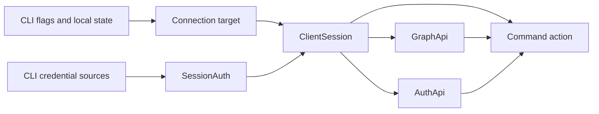

# CLI connection architecture

The private `connection` module owns one scoped bridge from existing CLI flags and local identity
state to the public Kernel Client. It selects the exact source Kernel URL and issuer, either omits
credentials for an explicit anonymous selection or resolves fresh source-Kernel authority for each
Call, binds Graph and Auth helpers, and closes every owned Client resource when the command action
terminates.

When a target also names an exact Domain issuer, or the origin of an installed Domain, the connection
owner obtains a Domain token through the Kernel Client's `session.exchange(issuer)`, which runs the
`whoami -> delegate(attenuation) -> issuer exchange` journey and admits the Domain response. The
connection owner keeps only what outlives one Client call: the persisted cache, the command-timeout
lifetime rules, retry of a delegation whose outcome is unknown, and the mapping of each Client
`ExchangeError` failure reason to a stable CLI error code. The resulting Domain token crosses into
ClientSession as an opaque credential; connection does not authorize Domain operations. Its carried
Grant must be exactly the caller proof. Fresh or cached credentials that add Domain self or any
other authority are rejected rather than forwarded to the Kernel.

```mermaid
flowchart LR
  F[CLI flags and local state] --> T[Connection target]
  T --> H[ClientSession]
  C[CLI credential sources] --> R[SessionAuth]
  R --> H
  H --> G[GraphApi]
  H --> A[AuthApi]
  H --> X[Command action]
  G --> X
  A --> X
```

ClientSession owns source admission, Publication discovery, redirect witnessing, route caching, transport
selection, and the single safe stale-route recovery. The CLI does not reproduce those rules or
discover destination identity. `SessionAuth.resolve(call, signal)` returns source-Kernel authority and
ClientSession supplies an audience-free Delegate with omitted attenuation, preserving the exact
current Grant for routing. Connection itself persists no credential or route; the separate state
owner persists exchanged source credentials and the separate Kernel Client route artifact. Stable
issuer and subject metadata from the selected persisted IdP identity may select only an exact,
cryptographically admitted exchange entry before source-token refresh. Missing, unreadable, or
mismatched metadata falls through to ordinary source resolution. Cache misses alone resolve the
registered Kernel User and perform delegation plus Domain exchange.
An Astrale-managed Instance exchanges its users through its installed Shell, named by origin
(`shell.astrale.ai`) and never by an issuer derived from the route: the Shell's issuer is whatever
the source Kernel's pin names. A bookmark that names an explicit exact Domain issuer is exchanged
there instead, managed or not. The bookmark registry carries a format label (`version`). A registry
without it was written by an earlier release, which stored the route-derived Shell issuer on managed
bookmarks without the user choosing it, so reading such a registry drops those two values from its
managed bookmarks (`lib/legacy/managed-shell-issuer.ts`); every bookmark write rewrites the whole
registry with the label, and in a labelled registry every `domainIssuer` is the user's.
The exchange reads the pin with `schema.inspect` through the same Client Session that already
authenticates the selected identity for `whoami` and `delegate`, so no issuer is needed before the
Kernel is reached. The state owner's installation cache remembers what the pin named per source
Kernel and origin, the same record a callable of the Shell Domain reads and writes, so a later
command exchanges at the remembered issuer, or selects the Domain credential persisted under it
before source-token refresh, without reading the pin again.
The Shell is reinstalled from immutable deployments with a consented issuer change, within the same
installation, so the remembered issuer is healed rather than trusted. A stale one fails closed: the
retired issuer no longer serves an exchange, or the Kernel rejects with 2002 the credential it
issued once it no longer accepts the previous issuer. Any failure of a command that relied on the
remembered issuer forgets it, as for a callable, so the next command reads the new pin and exchanges
there: after a reinstall, the first command of each user that presents a credential exchanged at the
old issuer outside the Kernel's acceptance window fails once, and its retry succeeds. A command that
read the pin itself keeps the record when it fails.
A session observes no reinstall after it chose its issuer. A command that already presented its
credential keeps it: if a reinstall lands during the command, its later Kernel calls are refused with
2002 once the Kernel no longer accepts the previous issuer, and the next command reads the new pin.
Whether the remembered issuer is forgotten follows the Kernel's verdict, not how the command ends.
The Client reports no call outcome to the credential it resolved, so the connection lifecycle hands
the action a context whose Kernel calls (the Session's own calls and its Schema, Graph, Auth and
content capabilities) report a 2002 to the installed issuer before the failure reaches the action:
a command that recovers from its calls' failures, such as the Studio's per-Class queries, still
forgets a remembered issuer the Kernel refused. Connection does not replay a call the Kernel refused.
An exchange that fails as a moved issuer would (the issuer no longer serves discovery or exchange,
or the Domain refuses with 2002) makes the session read the pin once more and, only when the pin
now names another issuer, exchange there once; when the pin cannot be read again, the exchange
failure and the issuer the session holds stand. A pin the Kernel refuses to read (the Domain is
absent or not ready, 1003 with `SCHEMA_NOT_FOUND` or `SCHEMA_NOT_READY`; the caller may not read it;
or the Kernel does not serve the read) or answers with invalid evidence fails with
`TOKEN_EXCHANGE_ISSUER_UNRESOLVED` naming its cause; any other read failure, a 1003 against the
read's own input included, keeps its own classification, as the source caller's first Kernel call
always reported it. There is no fallback issuer, and a Domain the Kernel hosts keeps the caller.
A command can also run on the Admin kernel (`call --admin [<bookmark>]` or `--admin-url <url>`):
the target is resolved exactly as for Admin Domain operations, and only the source Kernel changes.
A callable credential still selects the callable's declaring Domain from that kernel's
installation, so a Services Method hosted there is exchanged at Services and an Admin Method at
Admin; the Admin Domain issuer a direct Admin URL carries is part of the target, not a fallback.
A callable command needs the issuer of its declaring Domain before it can exchange. The state owner
remembers that installation fact per source Kernel and origin, so only the first command reads the
installed Publication through a discovery Session. The remembered issuer is not authority: a stale
issuer yields a credential the Kernel rejects, and any failure of a command that relied on it
forgets the entry so the next command reads the installation again. A Domain reinstalled from an
immutable deployment heals the same way as the Shell.
Exchange and destination-carrier authority cover the selected command timeout plus one bounded
receipt margin, never outlive the current source credential, and retain the existing one-minute
floor for short commands. A cached or freshly exchanged credential that cannot cover that lifetime
is refreshed or rejected before destination dispatch, so a long durable mutation does not first
discover expired callback authority after its provider effect commits.

Every ClientSession receives the CLI-owned `state/session-routes` representation capability. Kernel
Client still owns route keying, admission, expiry, and one safe stale/miss recovery; Connection does
not reproduce routing or add an Admin-only bypass.

`--anonymous` deliberately suppresses ambient and bookmark-default identities by omitting the
`SessionAuth` capability. It cannot be combined with `--as` or `--creds`; contradictory selections fail
before local identity state or a connection is opened. Public and optional callables can then
observe a genuinely anonymous caller, while required callables reject the request at the Kernel.

The target, timeout, and optional CA file are resolved before constructing the session. The CA file
customizes only the Fetch capability passed to Client. `withClientSession` and
`withAdminClientSession` are terminal lifecycle boundaries: success, failure, and cancellation all
close both the Client Session and its direct source-Auth client.

The command boundary projects typed Client failure identity, transport context, phase, and
invocation-only delivery evidence without inspecting a private cause message. Unknown native
failures become one honest unexpected diagnostic; their bounded cause graph is visible only under
explicit debug output. Every admitted Kernel reason remains available in machine output, while
human repair details require a bounded public Function issue or exact Query reason variant.
