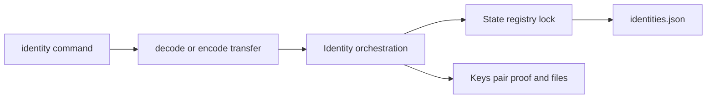

# CLI identity ownership

Identity owns local identity selection and the coordination between the State registry, per-subject
Keys, and IdP sessions. State owns durable registry decoding and locking; Keys owns JWK admission,
pair proof, and private files. Commands own prompts and presentation, not persistence mechanics.

Identity transfer accepts the retained unversioned plaintext envelope and the current V1 plaintext
or compact-JWE representation. Admission completes before mutation. Import checks the registry under
its file lock, persists the admitted keypair, and only then publishes the identity entry. Export
proves the stored pair and atomically writes one mode-`0600` user-selected file.

The canonical plaintext V1 structure is independently published as
`https://schemas.astrale.ai/cli/identity-export/1`. A production Host may emit that envelope as its
bootstrap root secret, but CLI Identity remains the format owner and cryptographically proves the
pair on import. The governing bootstrap flow imports the root as `platform-root`, authenticates it
directly to the `platform-manager` Kernel, and reaches a child only through a manager-minted
child-audience Management carrier. The carrier's outer subject is not the child's effective
principal; authenticated child `Identity.whoami` owns that projection.

Identity registration always prepares one self-proven atomic Provision request. Direct registration
submits it to Kernel Auth only when the selected caller already owns the target Class authority. An
explicit `--via <callable>` instead sends those exact bytes through the Domain that owns an
application Identity Class. The Domain callable owns admission and effect authority; CLI admits only
the prepared binding from the response before persisting its target-bound `(issuer, subject)`.

