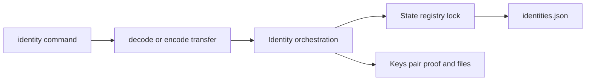

# CLI identity ownership

Identity owns local identity selection and the coordination between the State registry, per-subject
Keys, and IdP sessions. State owns durable registry decoding and locking; Keys owns JWK admission,
pair proof, and private files. Commands own prompts and presentation, not persistence mechanics.

Identity transfer accepts the retained unversioned plaintext envelope and the current V1 plaintext
or compact-JWE representation. Admission completes before mutation. Import checks the registry under
its file lock, persists the admitted keypair, and only then publishes the identity entry. Export
proves the stored pair and atomically writes one mode-`0600` user-selected file.

