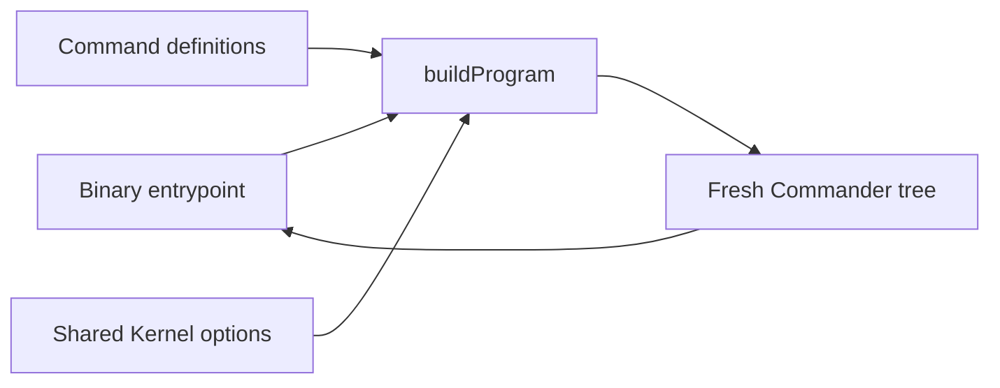

# CLI program architecture

The program module owns Commander composition, not command effects or process lifecycle. It loads
the existing command definitions only when `buildProgram` runs, attaches the single shared Kernel
option set, and returns a fresh unparsed tree. Command modules own their actions; the binary owns
argv, telemetry, signal, error, and exit handling.

The module is private to the CLI package. The exhaustive user-facing grammar remains the generated
Commander inventory rather than a duplicate declaration tree.
