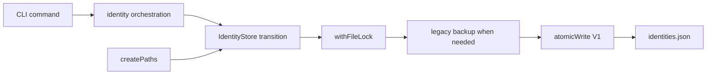

# CLI state architecture

This module owns CLI filesystem placement, the durable file-transition primitives shared by state
registries, and each registry's persistence admission. `createPaths` captures explicit and
environment coordinates once. `atomicWrite` publishes one complete `0600` file through a
same-directory temporary file. `withFileLock` bounds cross-process read-modify-write exclusion and
releases its lock on every terminal path.

The identity registry decodes the legacy unversioned shape and current V1 envelope into one semantic
`IdentityStore`. Reads never migrate. The first successful mutation of a legacy file preserves its
exact bytes at `identities.json.v0.bak` before publishing V1. Invalid or newer files remain untouched
and fail closed. Identity orchestration owns key and IdP-session effects above this module.

The exchange registry owns a versioned `exchange.Artifact`. Each entry is keyed by the atomic
`(Kernel issuer, Domain issuer, registered User)` identity and stores only one inspected Domain
credential and expiry. It reuses the same atomic-write and bounded file-lock primitives, maintains
owner-only directory and file modes, and remains distinct from Client's process-local route cache.

Shape decoding, migrations, and backup policy remain with each semantic registry. Commands do not
call these primitives directly, and Kernel Client owns no CLI filesystem state.

