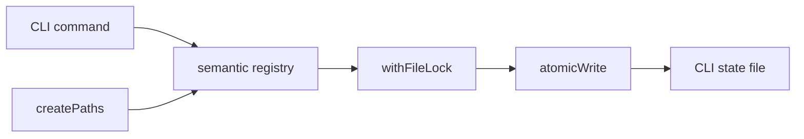

# CLI state architecture

This module owns only CLI filesystem placement and the durable file-transition primitives shared by
state registries. `createPaths` captures explicit and environment coordinates once. `atomicWrite`
publishes one complete `0600` file through a same-directory temporary file. `withFileLock` bounds
cross-process read-modify-write exclusion and releases its lock on every terminal path.

Shape decoding, migrations, and backup policy remain with each semantic registry. Commands do not
call these primitives directly, and Kernel Client owns no CLI filesystem state.

