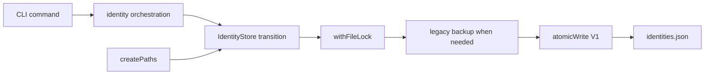

# CLI state architecture

This module owns CLI filesystem placement, the durable file-transition primitives shared by state
registries, and each registry's persistence admission. `createPaths` captures explicit and
environment coordinates once. `atomicWrite` publishes one complete `0600` file through a
same-directory temporary file. `withFileLock` bounds cross-process read-modify-write exclusion and
releases its lock on every terminal path.

The identity registry decodes the legacy unversioned shape and current V1 envelope into one semantic
`IdentityStore`. Reads never migrate. The first successful mutation of a legacy file preserves its
exact bytes at `identities.json.v0.bak` before publishing V1. Invalid or newer files remain untouched
and fail closed. Identity orchestration owns key and IdP-session effects above this module.

The exchange registry owns a versioned `exchange.Artifact`. Each V2 entry is keyed by the atomic
`(Kernel issuer, Domain issuer, source issuer, source subject)` identity and stores one inspected
Domain credential, expiry, and the exact registered Kernel User proven when that credential was
minted, together with the exact upstream source issuer and subject that selected the entry. This lets
a warm command validate and reuse the credential before any network `whoami` without accepting a
refresh result filed under another source identity.
V1 is not migrated or retained; it is discarded and replaced by the next exact exchange. The
registry reuses the same atomic-write and bounded file-lock primitives and maintains owner-only
directory and file modes.

The session-route registry is a separate representation adapter for Kernel Client's versioned,
bounded confidential route artifact. Kernel Client exclusively owns route keying, admission, expiry,
and stale/miss recovery. CLI owns only synchronous owner-private JSON I/O so a new CLI process can
reuse admitted routing state without an Admin-specific shortcut. Writes are atomic snapshots; a
lost concurrent cache update or any read/write failure is only a future cold route miss and cannot
change product correctness.
Authentication logout and identity deletion remove this artifact together with exchanged Domain
credentials so locally retired authority does not leave reusable destination bearers behind.

Shape decoding, migrations, and backup policy remain with each semantic registry. Commands do not
call these primitives directly, and Kernel Client owns no CLI filesystem state.

